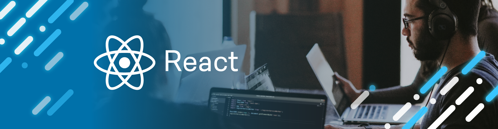

<main style="font-family: Tahoma">
<!-- image start -->

</img>

<!-- image end -->
<h1 align="center">Hi 👋, I'm anas asimi</h1>
<h4 align="center" style="color:#FF6969">A passionate frontend developer from Morroco</h4>
 

Here is my journey from the beginning, you can find my projects and training sites, I love to document all this here, I started in March 2022 and now I have HTML, CSS and JavaScript, and my journey continue

 
<!-- About me -->
<h2 style="color:#FF6969">About me:</h2>

- 🔭 I’m currently working on **E-commerce website**

- 👨‍💻 All of my projects are available at [my portfolio](asimianas.netlify.app)

- 💬 Ask me about **React**

- ⚡ Fun fact **I love problems**
 
 
<!-- Languages and Tools -->
<h2 style="color:#FF6969">Languages and Tools:</h2>

                

 
<!-- My Stats -->
<h2 style="color:#FF6969">My Stats :</h2>

 
<!-- Projects -->
<h2 style="color:#FF6969">My big Projects :</h2>
<ul>
<li><a href='https://asimianas.netlify.app'>Personal Portfolio</a></li>
<li><a href='https://genie-rural-toolkit.netlify.app/'>Genie Rural Toolkit</a></li>
<li><a href='https://soulara.netlify.app'>Soulara business</a></li>
<li><a href='https://github.com/anas-asimi/Egy-Best-Crawler-PupetterJs'>Egy-Best-Crawler-PupetterJs</a></li>
</ul>
 
<!-- Connect with me -->
<h2  style="color:#FF6969">Connect with me:</h2>

